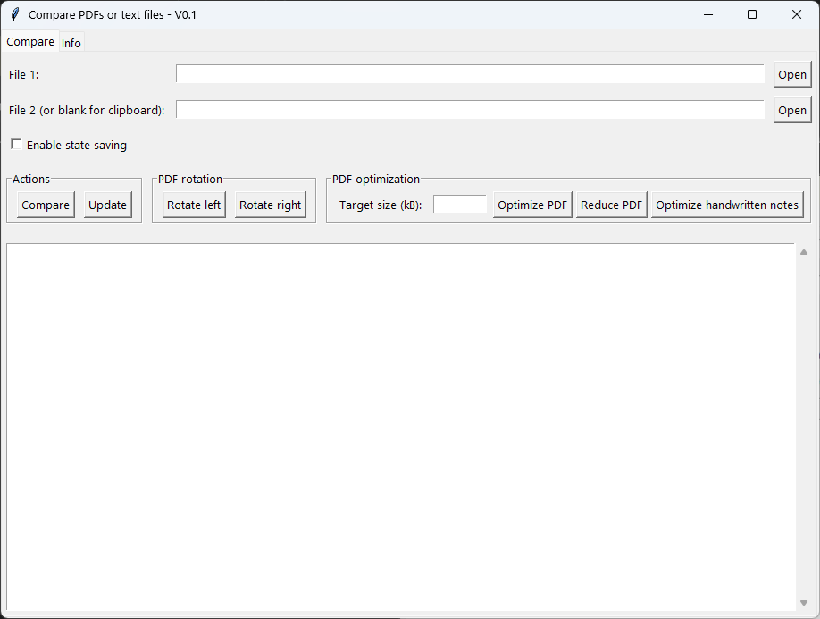

# Compare PDFs or Text Files

Compare PDFs or Text Files is your intelligent assistant for analyzing, optimizing, and enhancing PDF documents and text files.
Designed for efficiency and ease of use, this tool streamlines your document workflow with modern features and a user-friendly interface.

# Key Features

* Advanced Comparison
Effortlessly compare two PDFs, two text files, or a PDF and a text file. Differences are clearly highlighted, and a similarity percentage is provided for quick analysis.

* Clipboard Support
Instantly compare a file’s content with the current clipboard text for fast, on-the-fly checks.

* Drag & Drop Interface
Load your files simply by dragging and dropping them into the application for a seamless experience.

* PDF Rotation
Rotate PDF pages left or right by 90°, with automatic backup of the original file for maximum safety.

* PDF Optimization
Reduce PDF file size using advanced image compression and removal of unused objects, making your documents lighter and easier to manage.

* Handwritten Notes Enhancement
Apply special filters to scanned handwritten notes on grid paper—your scanned notes will be clearer and more readable.

* State Saving
The app automatically saves and restores your last comparison, so you can pick up right where you left off.

# How It Works

1. **Select Files**
Use the file selectors or drag and drop your files into the designated areas.

2. **Compare**
Click the "Compare" button to view highlighted differences and similarity scores.

3. **Optimize or Rotate**
Use the dedicated buttons to rotate or optimize your PDF files as needed.

4. **Enhance Notes**
Apply filters to make handwritten notes more legible.

# Requirements

- Python 3.x

***Install dependencies with:***

```bash
pip install PyPDF2 pikepdf Pillow PyMuPDF tkinter pyperclip opencv-python
```

# User Experience

* Modern, intuitive, and responsive interface
* Large, easy-to-use buttons for simple navigation
* Instant visual feedback for every action

You can download the latest version of the Windows application from the link below:


## Screenshots

Here is the main interface:



Comparison result example:


# Contributing & Feature Requests

Need a custom feature or have a suggestion?
Feel free to reach out!

* *Author*: Gian Michele Pasinelli
* *Email*: caludia@tiscali.it
* *PayPal*: [support the project](https://www.paypal.me/gianmichelepasinelli/5)

# License

This project is released under the MIT License.

# Contact

For bug reports, feature requests, or any other inquiry, please contact: caludia@tiscali.it
If you need a new PDF feature, just ask — I'm happy to help!

Enjoy comparing your PDFs and text files with ease!